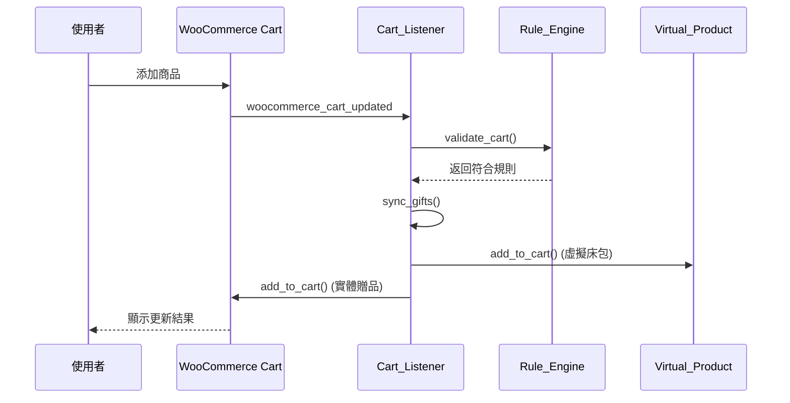

# 新年組合活動系統架構文件

## 📋 活動規則總覽

| 規則 | 條件 | 贈品 | 優先級 | 互斥組 |
|------|------|------|--------|--------|
| 規則7 | 嗜睡床墊+枕*2+賴床墊 | 天絲床包+茸茸被 | 70 | combo_major |
| 規則6 | 嗜睡床墊+床架+枕*2 | 天絲床包+茸茸被 | 60 | combo_major |
| 規則5 | 嗜睡床墊+床架 | 側睡枕 | 50 | combo_major |
| 規則2 | 枕頭*2 | $8888+枕套*2 | 40 | pillow_gift |
| 規則1 | 嗜睡床墊+催眠枕 | 茸茸被 | 30 | combo_major |
| 規則3 | 催眠枕 | 枕套 | 20 | pillow_gift |
| 規則4 | 賴床墊 | 抱枕+眼罩 | 10 | 無 |

---

## 🏗️ 系統架構

```
new-year-bundle-active/
├── new-year-bundle-active.php          # 主配置文件（常數定義）
└── helpers/
    ├── class-campaign-rule-engine.php  # 規則引擎（純邏輯）
    ├── class-cart-campaign-listener.php # 購物車監聽器（事件處理）
    └── class-virtual-bedding-product.php # 虛擬商品管理
```

### 資料流動



---

## ✅ 已實現功能

### 1. 全館折扣互斥機制

**實現位置**: `class-cart-campaign-listener.php`

**觸發時機**:
- `woocommerce_applied_coupon` - 套用優惠券時檢查
- `woocommerce_before_calculate_totals` (priority 1) - 計算前強制移除

**判定邏輯**:
1. 檢查優惠券代碼是否在 `NYB_GLOBAL_DISCOUNT_COUPONS` 白名單
2. 智能檢查：百分比折扣 + 無商品限制 = 全館折扣

**配置方式**:
```php
// new-year-bundle-active.php
define( 'NYB_GLOBAL_DISCOUNT_COUPONS', [
    'GLOBAL10',      // 實際優惠券代碼
    'SITEWIDE10',
] );
```

**擴展方式**:
```php
add_filter( 'nyb_global_discount_coupons', function( $coupons ) {
    $coupons[] = 'CUSTOM_COUPON';
    return $coupons;
} );
```

---

### 2. 虛擬商品顯示機制

**實現位置**: `class-virtual-bedding-product.php`

**顯示邏輯**:
- 原價：根據床墊尺寸從 `NYB_BEDDING_VALUE_MAP` 取得
- 售價：固定為 0
- 顯示格式：`<del>原價</del> <ins>$0</ins> 🎁 免費贈送`

**價值對應表**:
```php
NYB_BEDDING_VALUE_MAP = [
    2735 => 3680,  // 單人
    2737 => 4580,  // 雙人
    2739 => 4980,  // 雙人特大
    // ...
]
```

**整合方式**:
```php
// 規則引擎返回虛擬商品結構
[
    'virtual_product' => [
        'name'  => '天絲四件組床包',
        'value' => 4580,
        'sku'   => 'GIFT-BEDDING-2737',
    ],
    'quantity' => 1,
    'rule_name' => 'rule_6',
]

// 監聽器自動調用
NYB_Virtual_Bedding_Product::add_to_cart( $cart, $variation_id, 'bundle_rule_6' );
```

---

### 3. 贈品鎖定機制

**實現位置**: `class-cart-campaign-listener.php`

**保護措施**:

#### A. 禁止移除
```php
add_filter( 'woocommerce_cart_item_remove_link', 'disable_gift_removal' );
// 返回：🎁 活動贈品（無連結）
```

#### B. 禁止修改數量
```php
add_filter( 'woocommerce_cart_item_quantity', 'disable_gift_quantity_change' );
// 返回：1 (贈品) - 純文字顯示
```

#### C. 自動同步
- 條件不符時自動移除贈品
- 條件符合時自動添加贈品
- 防止手動干預

**識別標記**:
```php
// 實體贈品
$cart_item['nyb_is_gift'] = true;

// 虛擬床包
$cart_item['_nyb_virtual_bedding'] = true;
```

---

## 🔧 需要確認的機制問題

### ❓ 問題A：規則2的價格覆寫範圍

**當前實現**: 只修改前2顆枕頭價格為 $8888 / 2 = $4444

**潛在問題**:
- 如果購物車有3顆枕頭，第3顆是否維持原價？
- 如果同時有規則1（嗜睡+枕）和規則2（枕*2），價格如何處理？

**建議確認**:
```
情境1：購物車有3顆枕頭
- 前2顆：$4444/顆
- 第3顆：原價 ✅ 或 也是$4444 ❌

情境2：規則互斥後只保留規則1
- 枕頭價格：原價 ✅ 或 維持$4444 ❌
```

---

### ❓ 問題B：虛擬床包的訂單處理

**當前狀態**: `class-virtual-bedding-product.php` 有 `save_to_order()` 方法但已註解

**需確認**:
1. 訂單中是否需要顯示床包？
2. 床包是否需要計入訂單統計（營業額、商品數）？
3. 後台訂單是否需要特殊標記？

**建議啟用**:
```php
add_action( 'woocommerce_checkout_create_order_line_item',
    [ __CLASS__, 'save_to_order' ], 10, 4 );
```

---

### ❓ 問題C：贈品庫存管理

**當前實現**: 贈品直接調用 `add_to_cart()`，會扣除實際庫存

**潛在風險**:
- 贈品庫存不足時活動失效
- 贈品可能被一般訂單購買導致活動無法發放

**建議方案**:

#### 方案1：預留庫存
```php
// 設定贈品專用庫存池
update_post_meta( NYB_GIFT_FLEECE_BLANKET, '_campaign_reserved_stock', 100 );
```

#### 方案2：虛擬化贈品
```php
// 贈品不扣庫存，訂單成立後手動處理
add_filter( 'woocommerce_product_get_manage_stock', function( $manage, $product ) {
    if ( in_array( $product->get_id(), [ NYB_GIFT_FLEECE_BLANKET, ... ] ) ) {
        return false; // 不管理庫存
    }
    return $manage;
}, 10, 2 );
```

---

### ❓ 問題D：活動期間外的購物車處理

**當前實現**: `is_campaign_active()` 返回 false 時停止處理

**潛在問題**:
- 活動結束時，購物車中的贈品是否自動移除？
- 活動開始前加入的商品，活動開始後是否自動添加贈品？

**建議補充**:
```php
// 活動結束時清理贈品
if ( ! $this->is_campaign_active() ) {
    $this->remove_all_gifts();
    return;
}
```

---

### ❓ 問題E：多規則觸發時的贈品去重

**當前實現**: 互斥組只保留優先級最高的規則

**潛在問題**:
- 規則4（賴床墊→抱枕+眼罩）不在互斥組
- 如果同時觸發規則7和規則4，會同時發放兩組贈品

**需確認**:
```
情境：購物車有 嗜睡床墊+枕*2+賴床墊
- 規則7：床包+茸茸被 ✅
- 規則4：抱枕+眼罩 ✅
→ 總共4件贈品，是否符合預期？
```

---

### ❓ 問題F：價格覆寫的持久性

**當前實現**: 每次 `before_calculate_totals` 都重新設定價格

**潛在問題**:
- 如果使用者移除1顆枕頭，剩餘枕頭價格是否恢復原價？
- Session 過期後價格是否正確恢復？

**建議測試**:
```
1. 加入2顆枕頭 → 價格 $8888
2. 移除1顆 → 剩餘1顆應恢復原價
3. 重新整理頁面 → 價格是否正確
```

---

### ❓ 問題G：規則2的枕套贈送邏輯

**當前實現**: 根據枕頭 variation_id 從 `NYB_PILLOWCASE_MAP` 取得對應枕套

**需確認**:
```php
// 如果購物車有：
// - 2983 (枕頭A) * 1
// - 2984 (枕頭B) * 1

// 當前會贈送：
// - 4439 (枕套A) * 1
// - 5663 (枕套B) * 1

// 是否正確？還是應該讓使用者自選枕套款式？
```

---

### ❓ 問題H：床架的 variation 處理

**當前實現**: 床架使用 `product_id` 判定（`NYB_BED_FRAME_IDS`）

**需確認**:
- 床架是否有 variation（尺寸/顏色）？
- 如果有，是否需要修改判定邏輯？

```php
// 當前邏輯
if ( isset( NYB_BED_FRAME_IDS_MAP[ $product_id ] ) ) { ... }

// 如果床架有 variation，需改為
if ( isset( NYB_BED_FRAME_IDS_MAP[ $product_id ] ) ||
     isset( NYB_BED_FRAME_VARS_MAP[ $variation_id ] ) ) { ... }
```

---

## 📊 性能優化建議

### 1. 購物車更新頻率控制

**問題**: `woocommerce_cart_updated` 可能頻繁觸發

**建議**:
```php
// 添加防抖機制
private $last_validation_time = 0;

public function on_cart_updated() {
    $now = time();
    if ( $now - $this->last_validation_time < 2 ) {
        return; // 2秒內不重複驗證
    }
    $this->last_validation_time = $now;
    // ... 原邏輯
}
```

### 2. Session 快取優化

**建議**:
```php
// 添加購物車指紋，避免不必要的規則驗證
$cart_hash = md5( json_encode( $cart->get_cart_contents() ) );
$cached_hash = WC()->session->get( 'nyb_cart_hash' );

if ( $cart_hash === $cached_hash ) {
    return; // 購物車內容未變，跳過驗證
}
```

---

## 🧪 測試檢查清單

### 基礎功能測試
- [ ] 規則1-7 各自獨立觸發
- [ ] 互斥規則優先級正確
- [ ] 虛擬床包正確顯示價值
- [ ] 贈品無法移除
- [ ] 贈品數量無法修改

### 互斥測試
- [ ] 全館折扣券 + 活動規則 → 折扣券被移除
- [ ] 規則7 vs 規則6 → 只保留規則7
- [ ] 規則2 vs 規則3 → 只保留規則2

### 邊界測試
- [ ] 活動開始前加入商品 → 活動開始後自動添加贈品
- [ ] 活動結束後購物車 → 贈品自動移除
- [ ] 移除觸發商品 → 贈品同步移除
- [ ] 枕頭3顆 → 第3顆價格正確

### 訂單測試
- [ ] 贈品出現在訂單中
- [ ] 虛擬床包價值正確記錄
- [ ] 後台訂單顯示正確

---

## 📝 配置文件說明

### 修改活動期間
```php
// new-year-bundle-active.php
define( 'NYB_CAMPAIGN_START', '2025-01-05 00:00:00' );
define( 'NYB_CAMPAIGN_END', '2026-02-28 23:59:59' );
```

### 添加新的全館折扣券
```php
define( 'NYB_GLOBAL_DISCOUNT_COUPONS', [
    'GLOBAL10',
    'NEW_COUPON_CODE', // 新增
] );
```

### 修改規則優先級
```php
// class-campaign-rule-engine.php
const RULE_PRIORITY = [
    'rule_7' => 70,  // 調整數字改變優先級
    // ...
];
```

### 添加新規則
```php
// 1. 添加檢查方法
private static function check_rule_8( $analysis ) {
    // 條件判定邏輯
    return [
        'gifts' => [ ... ],
        'description' => '...',
    ];
}

// 2. 註冊優先級
const RULE_PRIORITY = [
    'rule_8' => 80,
    // ...
];

// 3. 如需互斥，加入互斥組
const MUTEX_GROUPS = [
    'combo_major' => ['rule_8', 'rule_7', ...],
];
```

---

## 🚨 已知限制

1. **虛擬床包尺寸**: 自動根據床墊尺寸決定，無法讓使用者選擇
2. **贈品枕套款式**: 自動根據枕頭款式決定，無法自選
3. **規則2價格覆寫**: 只影響前2顆枕頭，第3顆以上維持原價
4. **庫存管理**: 贈品會扣除實際庫存，需手動監控

---

## 📞 技術支援

如需修改規則邏輯或添加新功能，請確認：
1. 規則優先級是否正確
2. 互斥組設定是否合理
3. 贈品標記是否一致（`nyb_is_gift` 或 `_nyb_virtual_bedding`）
4. 日誌開關是否開啟（`NYB_DEBUG_MODE`）

